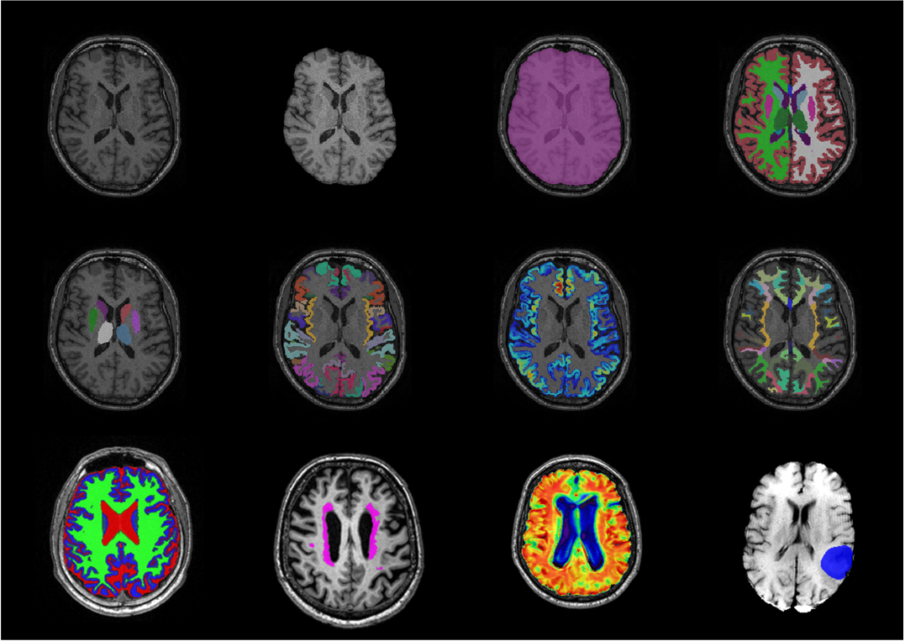

## Background


* This repo provides deep-learning methods for brain extration.
* We also provided the stand-alone application working on Windows, Mac, and Linux.



### Install stand-alone version
https://github.com/htylab/tigerbx/releases

### Usage

    tigerbx -bmad c:\data\*.nii.gz -o c:\output
    tigerbx -c c:\data\*.nii.gz -o c:\output

### As a python package

    pip install onnxruntime #for gpu version: onnxruntime-gpu
    pip install https://github.com/htylab/tigerbx/archive/release.zip

### As a python package

    import tigerbx
    tigerbx.run('bmadk', r'C:\T1w_dir', r'C:\output_dir')
    tigerbx.run('bmadk', r'C:\T1w_dir\**\*.nii.gz', r'C:\output_dir')
    tigerbx.run('bmadk', r'C:\T1w_dir\**\*.nii.gz') # storing output in the same dir
    tigerbx.run('dg', r'C:\T1w_dir') # Producing deep-gray-matter masks with GPU


** Mac and Windows  are supported.**

** Ubuntu (version >18.04)  are supported.**

** Typically requires about 1 minute to obtain deep gray matter segmenation without GPU**

```
>>tigerbet  c:\data\**\*T1w.nii -o c:\outputdir -b -m -a -d -f
-b: producing extracted brain
-m: producing the brain mask
-a: producing the aseg mask
-d: producing the deep gray mater mask
-k, Producing the dkt mask (work in progress)
-c, Producing the cortical thickness map (work in progress)
-w, Producing the white matter parcellation (work in progress)
-f: faster operation with low-resolution models
-q: Save QC score. Pay attention to QC scores less than 50.
```
## Citation

* If you use this application, cite the following paper:

1. Weng JS, Huang TY. Deriving a robust deep-learning model for subcortical brain segmentation by using a large-scale database: Preprocessing, reproducibility, and accuracy of volume estimation. NMR Biomed. 2022 Nov 23:e4880. doi: 10.1002/nbm.4880. (https://doi.org/10.1002/nbm.4880)


## Label definitions

For label definitions, please check here. [Label definitions](doc/seglabel.md)


